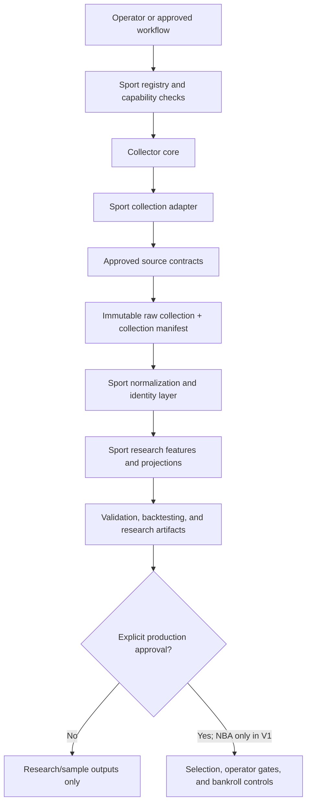

# CourtVision Platform Architecture V1

**Status:** Current architecture baseline
**Snapshot date:** 2026-06-30
**Repository baseline:** `data-collector-v1` (`6452c6f`)

## 1. Purpose and safety boundary

CourtVision V1 is a multi-sport research platform built around a production NBA runtime and a fail-closed path for adding new sports. The platform separates raw data custody, sport-specific interpretation, provider capabilities, research pipelines, and bankroll-facing decisions so that adding a collector or registering a plugin cannot silently make a sport production-ready.

The governing rule is default deny:

- Registration is metadata, not runtime activation.
- Collection is evidence acquisition, not normalization, projection, selection, or approval.
- Research readiness is not betting readiness.
- No sport, provider, dataset, model, or artifact receives production, betting, or Kelly eligibility by implication.
- Existing NBA bankroll-facing behavior remains outside the scope of the collector platform and must not be changed during sport onboarding.

## 2. Platform layers

| Layer | Responsibility | Must not do |
| --- | --- | --- |
| Sport registry | Declare sport, markets, modes, and capabilities. | Route execution or grant undeclared capabilities. |
| Provider registry | Declare provider sports, modes, data capabilities, credentials, source type, and safety status. | Select a provider, fetch data, or override sport approval. |
| Collector core | Validate collection requests and paths, dispatch adapters, copy/materialize raw files, compute evidence, and write an immutable manifest. | Understand sport schemas, normalize data, score candidates, or touch bankroll logic. |
| Sport collection adapter | Define the sport's approved source contracts, required inputs, source options, blockers, warnings, and permitted acquisition methods. | Introduce arbitrary runtime URLs, scrape prohibited sources, or promote collected data. |
| Raw custody | Preserve versioned source bytes and their provenance. | Overwrite an existing collection or masquerade generated data as a source. |
| Normalization and identity | Convert raw sources into typed sport-domain records and resolve stable identities. | Erase source lineage or mix post-event data into pre-event features. |
| Research/model | Build features, projections, datasets, backtests, and research reports. | Claim production readiness without separate validation and approval. |
| Decision and bankroll | Apply production selection gates, operator review, grading, and Kelly controls. | Consume research/sample artifacts unless explicitly approved through the production process. |

## 3. Collector core versus sport adapters

### Collector core

The sport-agnostic collector lives in `courtvision/data_collection/`. It owns mechanics that must behave identically for every sport:

- Validate sport, season, date range, timezone-aware collection timestamp, collection ID, and explicit raw output root.
- Resolve the registered collection adapter for the requested sport.
- Validate that planned sources are unique and conform to code-owned source contracts.
- Enforce output-root containment and protected-path rules.
- Support a no-write dry run that reports planned sources, blockers, and warnings.
- Create a versioned path of `<raw-root>/<sport>/<season>/<collection-id>/`.
- Copy supplied bytes or invoke an adapter-provided approved materializer.
- Record SHA-256, byte size, row count where supported, timestamps, provider/source labels, license notes, blockers, and warnings.
- Write exactly one `collection_manifest.json` using exclusive creation.
- Reject an existing collection directory rather than overwrite it.
- Remove only the new invocation-owned directory if collection fails partway through.

The core is intentionally raw-only. It must remain independent of league schemas, feature engineering, odds normalization, projections, selection thresholds, grading, and bankroll state.

### Sport adapters

Sport adapters live under `courtvision/sports/<sport>/data_collection/`. Each adapter owns domain policy while implementing the shared collection contract:

- The canonical lowercase sport key.
- A human-readable list of required source categories.
- A closed set of `SourceContract` objects.
- Accepted source options and their validation.
- Approved acquisition methods and materializers.
- Required-source blockers and optional-source warnings.
- Sport-specific source/provider and licensing descriptions.

An adapter may plan a partial collection and report blockers. Preserving a partial raw acquisition can be useful, but downstream readiness checks must treat unresolved blockers as incomplete evidence. An adapter must never convert a blocker into fabricated or sample data without an explicit sample-mode contract.

The adapter registry includes all five sport keys so unsupported sports fail in a known place. Registration of an adapter stub is not evidence that collection works.

## 4. Provider plugin design

V1 uses three complementary contracts rather than a single all-powerful plugin:

1. **Sport plugin:** `courtvision/core/sport_registry.py` declares markets, modes, and high-level capabilities for a sport. It is immutable and default-deny.
2. **Provider registration:** `courtvision/core/provider_registry.py` declares which sports, modes, and data domains a provider supports; its credential requirements; whether its source is live, sample, manual, mock, or historical; and whether it is explicitly safe for production, research, or sample use.
3. **Collection source contract:** `courtvision/data_collection/source_contracts.py` declares an approved raw source, acquisition method, extensions, provider/source label, and licensing note. These contracts are code-owned allowlist entries; callers may supply files or configuration but may not invent an arbitrary web source at runtime.

A provider implementation must satisfy all three relevant gates:

- The sport advertises the requested mode and capability.
- The provider advertises that sport, mode, and capability and passes credential checks.
- The sport adapter has an approved source contract for the acquisition being performed.

Provider resolution must fail closed. Missing credentials, unknown modes, undeclared capabilities, placeholder registrations, or sample/mock provenance cannot fall through to production. MLB providers are prohibited from production use in V1. Fixture, sample, manual, and historical providers remain visibly classified in every downstream artifact.

Collection providers and runtime context providers are related but not interchangeable. For example, an approved historical weather archive can be collected without establishing a live pregame weather provider. Likewise, a live odds research adapter does not by itself create a complete historical odds archive.

## 5. Manifest and provenance rules

### Raw collection manifest

Every non-dry-run collection receives one immutable `collection_manifest.json`. At minimum it binds:

- sport, season, requested start/end dates, collection ID, collection timestamp, and collector version;
- each source's stable name, type, provider/source label, licensing note, local relative path, SHA-256, byte size, optional row count, timestamp, warnings, and blockers;
- collection-level blockers and warnings.

Rules:

- Raw inputs are copied into the collection; manifests refer to the copied relative paths.
- Collection directories and manifests are create-only. Reusing a collection ID must fail.
- Hashes cover exact file bytes. A changed hash means changed evidence, even if a filename is unchanged.
- Source type and provider labels must be truthful and specific. `fixture`, `sample`, `manual`, `mock`, `historical`, and `live` are never interchangeable.
- Licensing/terms notes and source attribution travel with the evidence.
- Missing required sources remain explicit blockers. Warnings must not be silently dropped.
- Unsupported extensions, prohibited scraping sources, paths outside the output root, and ambiguous source contracts fail closed.
- StatMuse and sportsbook/bookmaker scraping are explicitly outside the V1 source boundary.

### Downstream provenance

Raw collection provenance must be carried forward, not replaced, by normalized, dataset, prediction, and evaluation manifests. Downstream records should retain the collection ID and source-manifest identifiers needed to reconstruct their lineage.

MLB already has additional source, partition, input-pack, dataset, preprocessing, prediction, and evaluation manifest contracts. These are downstream custody layers; they do not replace the raw collection manifest. They continue to require `approval_status: not_approved`, `eligible_for_betting: false`, and `kelly_eligible: false` while MLB remains research-only.

Operational artifact manifests describe what a run produced. They are useful for completeness checks but are not substitutes for source provenance.

## 6. Protected folders and boundaries

### Collector write-denied path categories

The collector's output root must not overlap protected components declared by `courtvision/data_collection/path_guards.py`, including:

- `outputs`, `runtime`, and `history`;
- `logs`;
- `cache`, `caches`, `.pytest_cache`, and `__pycache__` categories;
- `manual-data` / `manual_data`;
- `test-output`, `test-outputs`, and `test_outputs`.

Every created file must remain beneath the caller's explicit raw output root. The collector must never use a runtime output tree as raw source custody.

### Repository operationally protected areas

The following remain outside routine platform/onboarding edits unless a task explicitly authorizes them:

- Kelly sizing, eligibility, bankroll, and wager sizing.
- Grading, feedback, result history, and ROI calculations.
- Scoring formulas, thresholds, Elite thresholds, and selection gates.
- Existing provider fetching/auth, data-source priority, and odds normalization.
- Dashboard files and UI assets.
- Run scripts, batch/PowerShell scripts, and scheduled workflow entrypoints.
- `.env`, credentials, secrets, and provider keys.
- `outputs/`, `test_outputs/`, `.pytest_cache/`, logs, caches, and generated artifacts.
- Recalibration files unless recalibration is the explicit task.

Source collection work must not write to or derive approval from these areas.

## 7. Sport onboarding process

Each sport advances independently through these gates:

1. **Scope the research use case.** Define sport, markets, season coverage, intended mode, and explicitly excluded bankroll behavior.
2. **Inventory sources and rights.** Identify official or licensed schedule/results, player/team data, context sources, and historical odds. Record acquisition method, attribution, redistribution limits, credentials, and retention rules.
3. **Register metadata conservatively.** Add only modes and capabilities that exist now. Use a reserved plugin or placeholder provider for future intent.
4. **Define closed source contracts.** Specify stable source names, source types, provider labels, license notes, permitted extensions, and approved acquisition methods. No arbitrary URL injection.
5. **Implement the collection adapter.** Build a dry-run plan first; make missing required sources blockers and optional gaps warnings. Keep sport parsing out of the collector core.
6. **Prove raw custody.** Test path containment, no-overwrite behavior, rollback, exact hashes, row counts, manifest stability, prohibited-source rejection, and stub failure behavior.
7. **Add normalization and identity contracts.** Version schemas, preserve collection/source IDs, validate date coverage, and separate pre-event features from post-event labels.
8. **Validate a real historical pack.** Use approved, non-fixture data; verify completeness, crosswalks, temporal boundaries, leakage controls, and reproducibility.
9. **Enable research capability.** Only after the adapter and downstream contracts are tested should registry metadata advertise the new research capability.
10. **Run an independent promotion process.** Production mode, betting approval, operator outputs, and Kelly eligibility require explicit authorization and bankroll-facing regression validation. Collector completion alone can never satisfy this gate.

## 8. Current sport status

### MLB

MLB is the implemented V1 collector and the most developed non-NBA research lane.

Current collector capabilities:

- Statcast from an approved supplied CSV or optional `pybaseball` materialization.
- Retrosheet official archive/files as an optional supplied source.
- Chadwick Bureau Register as an optional supplied source.
- Meteostat or NOAA weather as an optional supplied archive.
- Approved supplied ballpark-factor CSV as a required source.
- Approved supplied historical odds provider/API/archive as a required source.
- Immutable versioned collection directories, raw byte copies, manifests, hashes, row counts, dry runs, blockers, warnings, and path guards.

Current broader research capabilities include the MLB home-run research/sample path, typed research contexts and provider protocols, fixture/sample composition, a research-only The Odds API adapter, ingestion/crosswalk prototypes, historical input packs, feature/label custody, temporal backtest contracts, leakage audits, preprocessing artifacts, window readiness, frozen predictions, validation/promotion evidence, and one-shot test evaluation.

MLB is still **research/sample only**. The sport registry advertises only odds and research-watchlist capabilities. It does not advertise production, schedule, projections, historical training, backtesting, betting approval, or Kelly sizing, even where research components exist. `mlb_sample` and `the_odds_api_mlb` are registered providers; MLB stats, weather, and ballpark runtime providers remain placeholders. No collected MLB artifact is bankroll-eligible.

### NBA, NFL, NHL, and WNBA collection stubs

| Sport | Collector status | Wider platform status | Required future source categories |
| --- | --- | --- | --- |
| NBA | Registered fail-closed stub; no collection source contracts and no writes. | Existing legacy production/research runtime remains the only production-facing sport. The collector stub does not replace or modify it. | Official schedule/results; licensed play-by-play and player data; licensed historical odds; approved context where applicable. |
| NFL | Registered fail-closed stub; no collection source contracts and no writes. | Reserved sport plugin with no modes or capabilities; projection module is placeholder-level only. | Official schedule/results; licensed play-by-play, rosters/injuries, weather, and historical odds. |
| NHL | Registered fail-closed stub; no collection source contracts and no writes. | Reserved sport plugin with no modes or capabilities. | Official schedule/results; licensed play-by-play, rosters, goalie/injury status, and historical odds. |
| WNBA | Registered fail-closed stub; no collection source contracts and no writes. | Reserved sport plugin with no modes or capabilities; projection module is placeholder-level only. | Official schedule/results; licensed play-by-play, player, roster/injury data, and historical odds. |

All four stubs intentionally raise `UnsupportedSportCollectionError`. Their presence in the adapter registry proves only that unsupported requests fail predictably.

## 9. Next milestones

1. **Exercise MLB collector V1 against a complete approved historical source set.** Produce a real, immutable collection with no required-source blockers and independently verify every hash, path, attribution, and date range.
2. **Bridge raw collection lineage into the MLB historical input pack.** Carry collection/source IDs through normalization, crosswalks, feature rows, labels, datasets, preprocessing, predictions, and evaluation artifacts.
3. **Close MLB provider placeholders for research.** Implement and validate explicit stats, schedule/lineup/probable-pitcher, weather, and ballpark context providers without enabling production mode.
4. **Reconcile registry capabilities with demonstrated MLB research behavior.** Advertise historical-training or backtesting capabilities only after real-data end-to-end evidence satisfies the existing readiness gates.
5. **Onboard the NBA collector without touching the legacy runtime.** Define licensed historical source contracts and raw custody as a parallel research path, then prove backward compatibility before any integration discussion.
6. **Onboard WNBA, NFL, and NHL one sport at a time.** Start with source/licensing inventories and dry-run adapters; keep each sport reserved until its own real-data evidence is complete.
7. **Add a platform-level provenance audit.** Verify that every downstream artifact can trace to immutable raw collection manifests and that sample/fixture/manual data cannot be mislabeled as live or production-ready.
8. **Define a separate production-promotion dossier.** Require explicit ownership, real-data validation, operational monitoring, failure recovery, bankroll regression tests, and approval before any new sport can approach betting or Kelly controls.

## 10. V1 invariants

- The collector core remains sport-agnostic and raw-only.
- Sport adapters own source policy; providers own acquisition implementations; neither owns bankroll approval.
- Existing collections are immutable and versioned.
- Provenance is additive across layers and never downgraded or discarded.
- Partial collections remain visibly blocked for downstream readiness.
- Stub sports fail before writing.
- Sample, fixture, mock, manual, and historical provenance cannot become production provenance through configuration alone.
- MLB remains research/sample only.
- NBA remains the only production-facing sport, through its existing legacy runtime.
- No onboarding task changes bankroll-facing logic without separate explicit approval.
