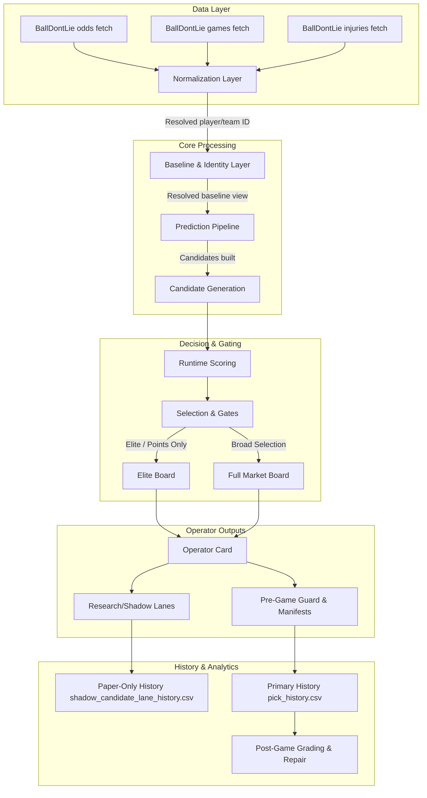

# CourtVision System Architecture

This document maps out the system architecture and operational model of the CourtVision system, an operator-assisted NBA player prop research and decision-support pipeline.

---

## 1. System Purpose

CourtVision is designed as an operator-assisted decision-support pipeline for NBA player prop analysis. It is **not** an auto-betting system. Instead, it aggregates data, generates predictions, and highlights high-conviction candidates for a human operator to review, approve, and execute.

Real-money capital allocation is strictly gated by the **Elite Board** and **Kelly Staking** modules. **Research/Shadow Lanes** (such as UNDER visibility audits, shadow candidate lanes, and incubator boards) exist purely for paper-trading, diagnostic tracking, and algorithm development. These research lanes can never bypass gates, promote candidates to real-money status, or influence Kelly sizing.

---

## 2. High-Level Architecture Flow

The following Mermaid flowchart maps the operational sequence of the CourtVision pipeline, from data ingest through predictions, gates, operator outputs, and historical grading.



---

## 3. Layer-by-layer Architecture

### A. Data Provider Layer
- **BallDontLie (BDL) Client**: The primary external client used to fetch odds, schedules, and active injuries.
- **Odds & Games Fetch**: Loads daily game matchups and player prop lines (over/under lines, odds).
- **Injuries Fetch**: Fetches active roster injuries to provide game context.
- **Provider Smoke Checks**: Checks for basic payload completeness (valid dates, player names, non-empty rosters).
- **Auth/Key Handling Boundaries**: The pipeline initializes BDL adapters using the `BALLDONTLIE_API_KEY` loaded from environment variables (`.env`). No keys are hardcoded in the codebase.

### B. Normalization Layer
- **Odds, Games, and Injuries Normalization**: Standardizes raw payloads from external schemas into consistent internal data structures.
- **Player/Team Identity Repair**: Matches team names/abbreviations (e.g. aligning Brooklyn as BKN vs BK) and maps player names using exact name-matching algorithms.
- **Player ID Joined Join**: Resolves names and provider IDs against canonical baseline files.

### C. Baseline and Identity Layer
- **player_baselines.csv**: A long-lived CSV file containing baseline projections and player statistical attributes.
- **Runtime Resolved Baseline View**: A dynamically joined view in memory linking active game slates, odds, and baseline statistics.
- **Identity Categories**:
  - `missing_team`: Returned if `player_id`, `candidate_team`, or `baseline_team` is missing.
  - `valid_current_team_override`: Triggered when a player's baseline team differs from the provider/candidate team, but they are resolved to a valid current team active on today's game slate. **This is not a true conflict**; it represents a successful team override that bypasses rejection and allows valid candidates to proceed.
  - `historical_stint_mismatch`: Triggered when a multi-stint player's team does not match their canonical team.
  - `stale_baseline_team`: Stale baseline team mapping that fails current active slate verification.
  - `true_identity_conflict`: The candidate team is not in the active game.

### D. Prediction Pipeline
- **Modules**: Canonical entry point is `courtvision_ai.py` which delegates execution to `courtvision/pipeline/predict_pipeline.py`.
- **Structures**: Uses `PredictionConfig` for configuring thresholds and parameters, and returns a `PredictionResult` holding dataframes for different lanes.
- **Execution Flow**: Build candidate universe, evaluate injuries, run recalibrations, compute edge, and assign lanes. surfeaces candidate counts and stage telemetry on console using `[COUNT]` prefixes.

### E. Runtime Scoring and Selection
- **runtime_scoring.py & runtime_selection.py**: Compute the final metrics (edge, confidence, quality score).
- **Caution Levels & Warnings**: Penalizes players with a rematch penalty (same opponent warning) or high volatility.
- **High-Caution OVER Gate**: Prevents high-caution OVER picks from making the Elite Board.
- **Elite Board vs Full Market Board**: The Elite Board represents high-conviction props (points-only, passing edge/confidence caps, and game/team caps). The Full Market Board displays all qualifying active player props.
- **Kelly Eligibility Boundaries**: Restricted to player points only (`points_only` mode). No shadow lanes or other statistical markets can feed the Kelly staking module.

### F. Research/Shadow Layer
- **Incubator / Shadow Modules**: Purely diagnostic modules used to study system behavior without financial risk.
  - `no_bet_funnel.py`: Identifies and logs properties rejected before selection.
  - `safe_action_discovery.py`: Discovers non-betting safe actions.
  - `shadow_candidate_lane.py`: Generates a shadow lane containing alternative picks (such as UNDERs and low-edge OVERs).
  - `shadow_candidate_lane_performance.py`: Measures paper performance of shadow candidates.
  - `under_visibility_audit.py`: Audits why UNDER props did not make the main board.
  - `under_research_snapshot.py` & `incubator_board.py`: Generate snapshots embedded in summaries.
- **Paper-Only Status**: All files generated by these modules are paper-only, diagnostic resources. They are not betting inputs and do not interact with Kelly staking.

### G. Reporting/Operator Layer
- **Operator Card & Daily Summary**: Text cockpits generated to summarize daily predictions and performance.
- **Watchlists**:
  - `near_elite_review`: Candidates just outside the elite quality thresholds.
  - `high_caution_over_watchlist`: OVER candidates blocked from Elite due to caution flags.
  - `combo_under_watchlist`: High-performing UNDER shadow candidates.
- **Research Artifact Orchestrator**: `write_research_artifacts.py` runs research reporting scripts in a safe, nonfatal sequence.
- **Pre-Game Finalization Guard**: `pre_game_finalization_guard.py` evaluates all required artifacts, date alignments, and disclaimers before lock.

### H. History/Grading Layer
- **pick_history.csv**: Canonical historical repository for approved, real-money betting picks.
- **shadow_candidate_lane_history.csv**: Historical repository for paper-only shadow candidates.
- **incubator_history.csv**: History of incubator board predictions.
- **Closed-Slate Safety**: Historical slates are protected. The daily script (`run_today.ps1`) blocks overwriting past prediction dates to prevent slate contamination.

### I. Orchestration Layer
- **run_today.bat & run_today.ps1**: Primary operational script suite for executing the daily pipeline.
- **scripts/write_research_artifacts.py**: Command sequence orchestrator for research reports.
- **scripts/pre_game_finalization_guard.py**: Final pre-lock validation check.

### J. Safety Layer
- **No Threshold Modifications**: Research reporting scripts are read-only and cannot alter the prediction thresholds of the pipeline.
- **No UNDER Promotion**: UNDERs are strictly paper-only; no UNDER can be marked as real-money eligible.
- **No Kelly from Shadow Lanes**: Kelly calculations can only run against the officially approved Elite Board.
- **Date Integrity Guard**: Disallows persisting history when the source data date does not match the prediction date.
- **Pre-Game Finalization Guard**: Block lock actions if required outputs are missing or date mismatch/history contamination is found.

---

## 4. Artifact Inventory

The following table catalogs the key files generated during the CourtVision lifecycle.

| Artifact Path Pattern | Producer Script/Module | Consumer | Purpose | Real-Money Relevance | Paper-Only | Safe to Delete Before Rerun | Safe to Regenerate After Start |
| :--- | :--- | :--- | :--- | :---: | :---: | :---: | :---: |
| `outputs/runtime/operator/elite_board_*.csv` | `courtvision/pipeline/predict_pipeline.py` | Operator / Kelly | High-conviction approved picks | **YES** | NO | YES | NO |
| `outputs/runtime/operator/full_market_board_*.csv` | `courtvision/pipeline/predict_pipeline.py` | Operator / Research | Broad slate candidates | NO | YES | YES | NO |
| `outputs/runtime/operator/sgp_board_*.csv` | `courtvision/pipeline/predict_pipeline.py` | Operator | Same Game Parlay candidates | NO | YES | YES | NO |
| `outputs/runtime/operator/daily_summary_*.txt` | `scripts/write_daily_summary.py` | Operator | High-level daily slate summary | NO | YES | YES | YES |
| `outputs/runtime/operator/quality_summary_*.txt` | `scripts/write_quality_summary.py` | Operator | Candidate quality telemetry | NO | YES | YES | YES |
| `outputs/runtime/operator/operator_card_*.txt` | `scripts/write_operator_card.py` | Operator Cockpit | Decision-support interface | **YES** | NO | YES | YES |
| `outputs/runtime/operator/no_bet_funnel_report_*.txt` | `scripts/write_no_bet_funnel_report.py` | Operator / Developer | Candidate exclusion tracking | NO | YES | YES | YES |
| `outputs/runtime/operator/safe_action_discovery_report_*.txt` | `scripts/write_safe_action_discovery_report.py` | Operator / Developer | Non-betting safe actions | NO | YES | YES | YES |
| `outputs/runtime/operator/shadow_candidate_lane_*.csv` | `scripts/write_shadow_candidate_lane_report.py` | Shadow Lane Grader | Tracks shadow candidates | NO | **YES** | YES | YES |
| `outputs/runtime/operator/shadow_candidate_lane_report_*.txt` | `scripts/write_shadow_candidate_lane_report.py` | Operator | Summarizes shadow candidates | NO | **YES** | YES | YES |
| `outputs/runtime/operator/shadow_candidate_lane_performance_*.txt` | `scripts/write_shadow_candidate_lane_performance.py` | Operator | Analyzes shadow accuracy | NO | **YES** | YES | YES |
| `outputs/runtime/operator/under_visibility_audit_*.txt` | `scripts/write_under_visibility_audit.py` | Operator / Developer | Audits UNDER candidates | NO | **YES** | YES | YES |
| `outputs/runtime/operator/pre_game_finalization_guard_*.txt` | `scripts/pre_game_finalization_guard.py` | Operator / Lock Script | Pre-game safety checks | **YES** | NO | YES | YES |
| `outputs/runtime/diagnostics/*.json` | Various scripts | System diagnostics | Telemetry and status logs | NO | YES | YES | YES |
| `data/history/pick_history.csv` | `scripts/post_run_tracking.py` | System Dashboard | Primary real-money history | **YES** | NO | **NO** | YES |
| `data/history/shadow_candidate_lane_history.csv` | `scripts/write_shadow_candidate_lane_performance.py` | Dashboard | Long-term shadow history | NO | **YES** | **NO** | YES |
| `data/history/incubator_history.csv` | `scripts/grade_market_shadow_history.py` | Dashboard | Long-term incubator history | NO | **YES** | **NO** | YES |

---

## 5. Canonical Workflows

### A. Normal Pre-Game Workflow
1. Pull the latest code updates:
   ```powershell
   git pull origin main
   ```
2. Verify all test coverage is passing:
   ```powershell
   py -3.13 -m pytest
   ```
3. Run the daily prediction pipeline for the active date (e.g. `2026-05-30`):
   ```powershell
   .\run_today.bat 2026-05-30
   ```
4. Run the finalization guard script to verify all constraints:
   ```powershell
   py -3.13 scripts\pre_game_finalization_guard.py --prediction-date 2026-05-30
   ```
5. Lock the generated artifacts.

### B. Final Pre-Game Lock Workflow
1. Execute the main prediction pipeline run:
   ```powershell
   .\run_today.bat 2026-05-30
   ```
2. Execute the pre-game finalization guard:
   ```powershell
   py -3.13 scripts\pre_game_finalization_guard.py --prediction-date 2026-05-30
   ```
3. Inspect the written `operator_card_2026-05-30.txt` file and verify that the status reports `READY_TO_LOCK`.
4. Preserve the finalized artifacts in the `outputs/runtime` directory without mutating them.

### C. Post-Game Workflow
1. **Do not rerun prediction boards**.
2. Execute the night-time grading pass to evaluate settled options:
   ```powershell
   py -3.13 scripts\grade_completed_picks.py --prediction-date 2026-05-30
   py -3.13 scripts\repair_pending_grades.py --prediction-date 2026-05-30
   ```
3. Run shadow lane grading to score the paper-only historical lanes:
   ```powershell
   py -3.13 scripts\grade_market_shadow_history.py --prediction-date 2026-05-30
   ```
4. Verify that pre-game prediction files remain unchanged.

---

## 6. Known Safety Invariants

The following invariants protect the financial integrity of the CourtVision system and must never be violated under any circumstances:

1. **Shadow Eligibility Isolation**: `shadow_only=True` candidates are strictly diagnostic. They can never have `real_money_eligible` or `kelly_eligible` set to True.
2. **Read-Only Research Integrity**: Research artifact generation scripts (funnel, audit, shadow lanes) must remain reporting-only. They are prohibited from editing prediction thresholds or mutating the final decisions.
3. **Kelly Sizing Market Bounds**: Kelly staking is strictly gated to player points props (`points_only` mode). No other prop market (assists, rebounds, sgp) can feed Kelly stakes.
4. **Over Calibration Restrictions**: High-caution OVER picks flagged with rematch warnings must remain blocked by the high-caution OVER selection gate.
5. **History Date Isolation**: Mismatched source dates must block the persistence of shadow lane histories. The `source_artifact_date` must match the `prediction_date` exactly.
6. **Immutable Pick History**: `pick_history.csv` represents official financial records and must never be modified by automated research scripts or the pre-game guard.
7. **Closed-Slate Prediction Freezes**: Rerunning predictions on a closed/historical slate is blocked by the script unless the operator specifies an override, preserving raw decision memory.
