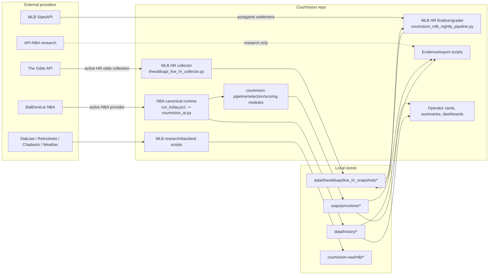
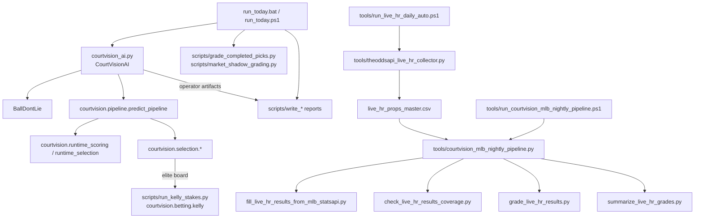
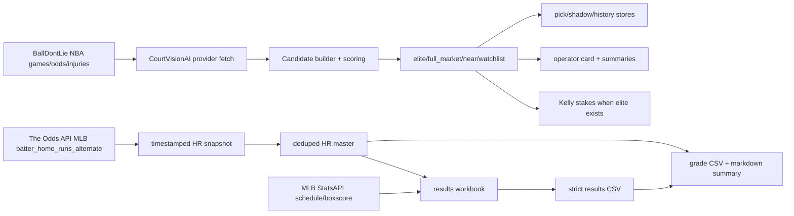
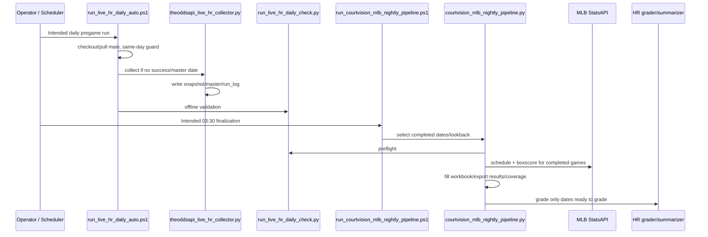
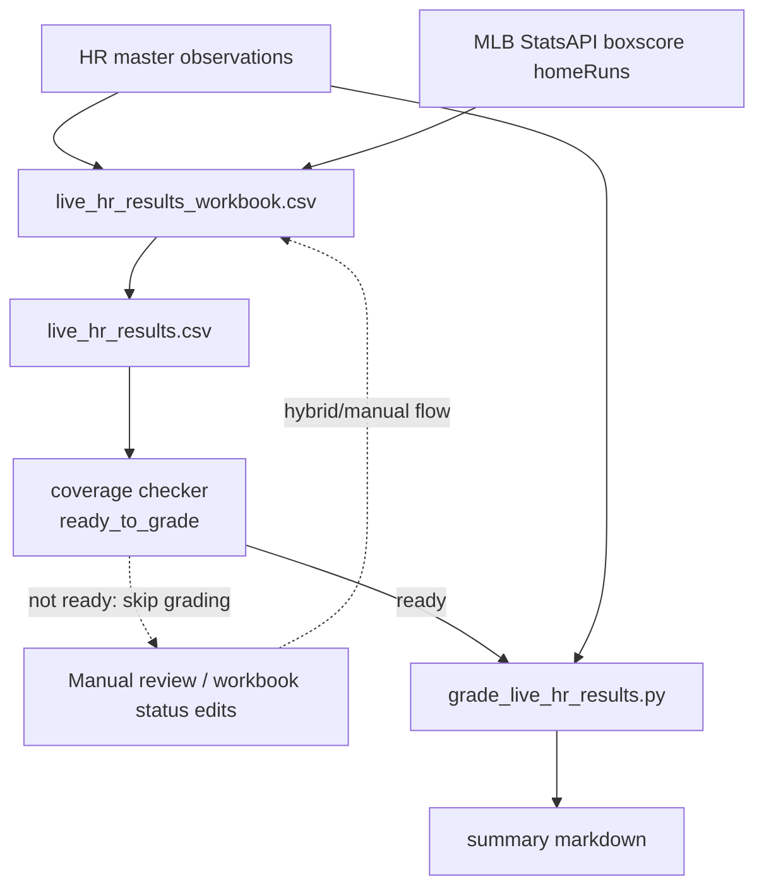
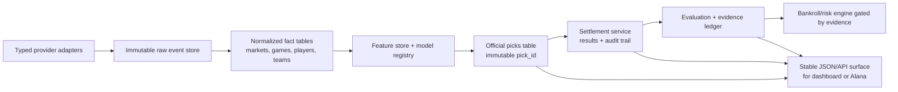

# System Architecture

## Architecture Classification

CourtVision is a mixture of:

| Classification | Applies? | Evidence | Confidence |
| --- | --- | --- | --- |
| One unified application | Partly | Package modules and `courtvision_ai.py` share core concepts. | Medium |
| Multiple loosely connected pipelines | Yes | NBA `run_today`, MLB HR tools, evidence tools, and MLB research scripts have separate triggers and data stores. | Confirmed |
| Collection of scripts | Yes | 130 operational scripts/wrappers inventoried. | Confirmed |
| Partially orchestrated system | Yes | `run_today.ps1` and `tools/courtvision_mlb_nightly_pipeline.py` orchestrate multi-step workflows. | Confirmed |
| Production-ready platform | No | Missing official pick identity, forward evidence, monitoring, and reproducible deployment. | High confidence |
| Research prototype | Yes, for MLB and other sports | MLB HR research docs/scripts; WNBA/NFL/NHL scaffolding. | Confirmed |

## Current System Context

## Layered Architecture

| Layer | Components | Inputs | Outputs | Failure points | Operational status |
| --- | --- | --- | --- | --- | --- |
| Provider access | `BallDontLieClient`, The Odds API collector, MLB StatsAPI filler, API-NBA smoke clients | API keys/env vars, endpoint URLs | Provider payloads/normalized rows | Key expiration, quota, schema drift, service outage | NBA/MLB active, API-NBA research-only |
| Raw ingestion | MLB collector, MLB historical ingest scripts | APIs, local CSV packs | Snapshots, raw manifests | Credit exhaustion, partial downloads, duplicate snapshots | Active for HR, research for historical MLB |
| Storage | `outputs/runtime`, `data/history`, `data/theoddsapi`, `courtvision-raw` | Runtime/generated rows | CSV/JSON/TXT artifacts | Local-only generated data, stale ignored files | Operational with reproducibility risk |
| Normalization | `bdl_odds_adapter`, MLB name normalization, candidate builders | Provider rows | Canonical candidate/market rows | Identity mismatch, market naming differences | Active/supporting |
| Feature/scoring | NBA baselines, context/injury modules, runtime scoring, MLB HR research scorer | Historical/runtime context | Projections, edges, confidence, quality | Look-ahead/leakage, stale baselines, hard-coded thresholds | NBA active, MLB research |
| Selection | `operator_boards`, `pipeline_selectors`, runtime selection | Candidate rows | Elite/full-market/near/watchlist boards | Over-filtering, empty elite, unsupported market gates | NBA active |
| Staking | `scripts/run_kelly_stakes.py`, `courtvision/betting/kelly.py` | Elite board, bankroll env | Kelly CSV | Insufficient evidence, cap assumptions, malformed odds | NBA points-only active with guardrails |
| Results | NBA grading scripts, MLB StatsAPI filler/workbook/exporter | Game outcomes, boxscores, manual statuses | Strict result CSVs/histories | Missing players, postponed games, manual unresolved rows | Partial/hybrid |
| Grading | `grade_completed_picks.py`, `grade_live_hr_results.py`, shadow graders | Picks/observations + results | Graded CSVs, summaries | Observation-vs-pick confusion, duplicate identity | Implemented with risks |
| Reporting | Operator cards, daily summaries, quality summaries, dashboards | Boards, histories, logs | TXT/JSON/CSV/Streamlit views | Stale files, generated output churn | Active/supporting |
| Automation | PowerShell wrappers, scheduled-task installers | Local repo, venv/python, env vars | Logs/artifacts | Mutable git pull, no central lock/alert, hard-coded paths | Partial |

## Component Diagram

## Current Data Flow

## Automation Diagram

## Results And Grading Workflow

## Proposed Future Target Architecture

This diagram is proposed, not current.

