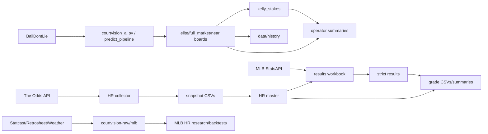

# Data Lineage

## Data Inventory

| Dataset | Producer | Consumer | Format | Update Pattern | Current Role |
| --- | --- | --- | --- | --- | --- |
| `outputs/runtime/operator/elite_board_DATE.csv` | NBA prediction/selection pipeline | Kelly, operator card, history/evidence | CSV | Date-scoped overwrite/regenerate | Official NBA elite candidate board |
| `outputs/runtime/operator/full_market_board_DATE.csv` | NBA prediction pipeline | audits, reports, shadow analysis | CSV | Date-scoped overwrite/regenerate | Live market universe/review context |
| `outputs/runtime/operator/near_elite_review_DATE.csv` | NBA selection/reporting | operator review, summaries | CSV | Date-scoped | Review-only candidates |
| `outputs/runtime/operator/kelly_stakes_DATE.csv` | `scripts/run_kelly_stakes.py` | operator card/history | CSV | Date-scoped | Stake recommendations when eligible |
| `outputs/runtime/operator/operator_card_DATE.txt` | `scripts/write_operator_card.py` | operator | TXT | Date-scoped | Final daily decision |
| `outputs/runtime/operator/daily_summary_DATE.txt` | `scripts/write_daily_summary.py` | operator/evidence | TXT | Date-scoped | Human daily run summary |
| `outputs/runtime/operator/quality_summary_DATE.json` | `scripts/write_quality_summary.py` | operator/evidence | JSON | Date-scoped | Run health/quality flags |
| `outputs/runtime/logs/run_today_DATE.log` | `run_today.ps1` | operators/auditors | LOG | Date-scoped append/write | Execution evidence |
| `data/history/pick_history.csv` | `scripts/post_run_tracking.py`, grading scripts | reports/evidence | CSV | Append/update | NBA pick lifecycle history |
| `data/history/market_shadow_history.csv` | shadow grading | shadow reports | CSV | Append/update | NBA shadow-lane performance |
| `data/history/prediction_history.csv` | NBA runtime/history scripts | analysis | CSV | Append/update | Historical prediction/candidate archive |
| `data/history/incubator_history.csv` | incubator/shadow scripts | analysis | CSV | Append/update | Incubator lane history |
| `data/history/evidence_daily_manifest.csv` | evidence scripts | evidence reports | CSV | Append | Forward evidence manifest |
| `data/history/evidence_ledger.csv` | evidence scripts | evidence reports | CSV | Append/update | Forward evidence ledger |
| `data/theoddsapi/live_hr_snapshots/live_hr_props_*.csv` | MLB HR collector | audit/debug/replay | CSV | Immutable timestamped writes | Raw HR market snapshots |
| `data/theoddsapi/live_hr_snapshots/live_hr_props_master.csv` | MLB HR collector | workbook, checks, grader | CSV | Append then dedupe | HR market observation master |
| `data/theoddsapi/live_hr_snapshots/run_log.csv` | MLB HR collector/wrapper | same-day guard/audit | CSV | Append | API usage/run evidence |
| `data/theoddsapi/live_hr_snapshots/live_hr_results_workbook.csv` | workbook generator, StatsAPI filler, manual edits | exporter/coverage | CSV | Regenerate while preserving result fields | Hybrid result workbench |
| `data/theoddsapi/live_hr_snapshots/live_hr_results.csv` | exporter | coverage/grader | CSV | Overwrite with flag | Strict HR settlement input |
| `data/theoddsapi/live_hr_snapshots/live_hr_grades_YYYYMMDD.csv` | HR grader | summary/performance review | CSV | Date-scoped write | Graded HR observations |
| `data/theoddsapi/live_hr_snapshots/reports/live_hr_grade_summary_DATE.md` | HR summarizer | humans | Markdown | Date-scoped write | HR observation performance summary |
| `data/theoddsapi/live_hr_snapshots/automation_logs/*` | PS/Python automation | operators/auditors | LOG/JSON/TXT | Timestamped | Automation evidence |
| `courtvision-raw/mlb/*/collection_manifest.json` | MLB collection scripts | dataset builders/auditors | JSON | Versioned/raw | Historical data provenance |
| `courtvision-raw/mlb/*/*.csv` | MLB collection scripts | dataset builders | CSV | Versioned/raw | Historical source data |
| `data/manual/mlb/hr/*/dataset.csv` | manual/research builders | MLB HR research validators | CSV | Manual/versioned | Small dry-run dataset |
| `outputs/model/calibration.json` | model/calibration scripts | NBA runtime scoring | JSON | Regenerated by calibration | Calibration settings |
| `outputs/runtime/research/player_predictions_DATE.csv` | NBA runtime | research/reports | CSV | Date-scoped | Research prediction output |
| `outputs/runtime/research/model_metrics_DATE.json` | NBA runtime | research/reports | JSON | Date-scoped | Model metric snapshot |

## Producer-Consumer Matrix

| Producer | Produced datasets | Primary consumers |
| --- | --- | --- |
| `courtvision_ai.py` / NBA package pipeline | operator boards, research predictions, diagnostics | validation, Kelly, reports, histories |
| `scripts/run_kelly_stakes.py` | Kelly stakes CSV | operator card, human operator |
| `scripts/post_run_tracking.py` | `pick_history.csv` rows | grading, performance reports |
| `scripts/grade_completed_picks.py` | graded history updates | operator reports/evidence |
| `tools/theoddsapi_live_hr_collector.py` | HR snapshots, master, run log | daily checks, workbook, grader |
| `tools/generate_live_hr_results_workbook.py` | workbook | StatsAPI filler, manual review, exporter |
| `tools/fill_live_hr_results_from_mlb_statsapi.py` | filled workbook/diagnostics | exporter/coverage |
| `tools/export_live_hr_results_from_workbook.py` | strict results CSV | coverage checker, grader |
| `tools/grade_live_hr_results.py` | HR grade CSV | summary/reporting |
| `scripts/mlb_ingest_*` | raw MLB source files/manifests | MLB dataset builders/backtests |
| Evidence scripts | evidence manifest/ledger | forward-trial review |

## Data Lineage Graph

## Current Row Counts And Dates

Observed safely from existing local CSVs/logs:

| Dataset | Rows / evidence | Notes |
| --- | --- | --- |
| `live_hr_props_master.csv` | 5,200 rows | Snapshot dates 2026-07-01 through 2026-07-10; duplicate count 0 in latest postflight log. |
| `run_log.csv` | 8 rows | Latest 2026-07-10 success: 12 events scanned, 861 rows saved, credits remaining recorded. |
| `live_hr_results_workbook.csv` | 1,371 rows | Statuses include final, void, void_candidate, and blanks. |
| `live_hr_results.csv` | 1,371 rows | Strict export mirrors workbook status counts. |
| `pick_history.csv` | 167 rows | Dates through 2026-05-13; stale relative to later runtime outputs. |
| `market_shadow_history.csv` | 1,856 rows | Dates through 2026-06-03. |
| `prediction_history.csv` | 9,067 rows | Historical NBA prediction/candidate archive. |

## Source-Of-Truth Vs Generated

| Category | Files | Notes |
| --- | --- | --- |
| Source-of-truth for NBA daily official candidates | `elite_board_DATE.csv`, `pick_history.csv`, evidence ledger when used | Needs immutable pick IDs to be stronger. |
| Source-of-truth for MLB HR observations | timestamped snapshots and `live_hr_props_master.csv` | Observations, not picks. |
| Source-of-truth for MLB HR settlement | `live_hr_results_workbook.csv` plus strict `live_hr_results.csv` | Workbook can involve manual/hybrid status decisions. |
| Generated/temporary outputs | `outputs/runtime/*`, grade summaries, logs | Useful evidence but should not be treated as source code. |
| Raw historical source packs | `courtvision-raw/mlb/*` | Local/ignored raw data; reproducibility depends on manifests and files. |

## Data Risks

| Risk | Evidence | Impact |
| --- | --- | --- |
| Official pick identity is implicit/composite. | NBA and MLB use combinations of fields, not one universal `pick_id`. | Duplicate/settlement/performance ambiguity. |
| Market observations can be mistaken for picks. | HR master/grader operate on every odds observation. | Inflated or misleading ROI. |
| Histories are stale relative to outputs. | `pick_history.csv` ends before many later output dates. | Incomplete feedback loop. |
| Generated ignored data is large/local. | `courtvision-raw`, `outputs`, `data` large and local. | Reproducibility/deployment risk. |
| Manual workbook states remain. | `void_candidate` and blanks in HR workbook. | Not every row is gradeable. |

