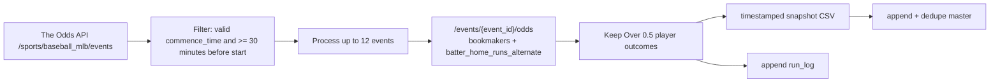
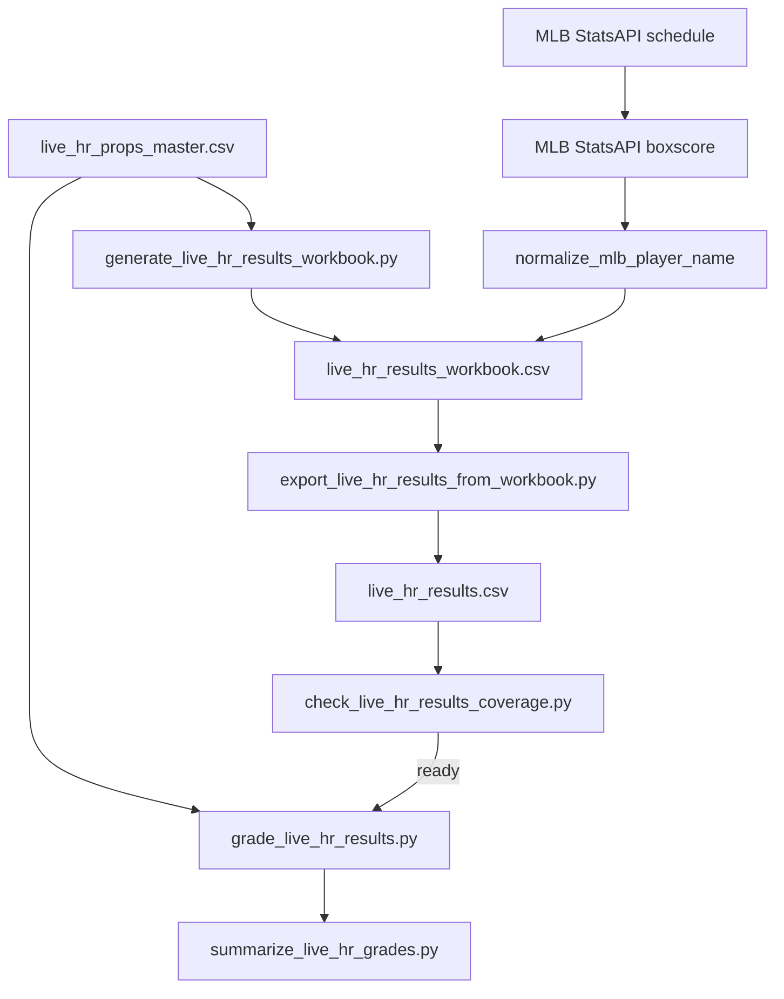

# MLB Home-Run Prop Pipeline Audit

## Current Classification

The MLB HR subsystem is an active data-collection and result-grading workflow for home-run prop market observations. It is not currently an official live pick generation system.

| Claim | Status | Evidence |
| --- | --- | --- |
| Collects MLB HR odds | Confirmed | `tools/theoddsapi_live_hr_collector.py`, `run_log.csv` |
| Finalizes HR results | Confirmed | `tools/fill_live_hr_results_from_mlb_statsapi.py` |
| Grades observations | Confirmed | `tools/grade_live_hr_results.py`, recent grade CSVs |
| Produces official CourtVision picks | Not confirmed; evidence says no | No active official-pick layer in HR collector/finalizer |
| Has research modelling contracts | Confirmed | `courtvision/sports/mlb/`, `scripts/mlb_*`, `docs/COURTVISION_MLB_HR_*` |
| Ready for bankroll use | No | Missing official picks, model validation, immutable pick identity |

## Collection Timing And Scope

| Question | Answer | Evidence |
| --- | --- | --- |
| Intended collection time | Daily pregame collection; docs mention Windows task `CourtVision MLB Live HR Daily` at 11:30. | `docs/mlb_live_hr_daily_ops.md`, `tools/run_live_hr_daily_auto.ps1` |
| Intended 3:30 a.m. task | Postgame finalization and grading for completed dates. | `docs/mlb_live_hr_daily_ops.md`, `tools/run_courtvision_mlb_nightly_pipeline.ps1` |
| Does 3:30 collect odds? | No evidence. Consolidated nightly pipeline does not call `theoddsapi_live_hr_collector.py`. | `tools/courtvision_mlb_nightly_pipeline.py` |
| Pregame or live? | Pregame-like collection only: skips events starting in fewer than 30 minutes. | `MIN_MINUTES_BEFORE_GAME = 30` |
| Max events | 12 events per run. | `MAX_EVENTS_PER_RUN = 12` |
| Market | `batter_home_runs_alternate`; flattened to Over 0.5 / 1+ HR rows. | collector constants and `flatten_1_plus_hr` |
| Bookmakers requested | DraftKings, FanDuel, BetMGM, bet365, Fanatics, ESPN BET, BetRivers. | `BOOKMAKERS` constant |
| Books observed in recent master | BetMGM, DraftKings, ESPN BET, FanDuel. | latest master/postflight summary |

## Collection Data Flow

## Collector Behavior

| Aspect | Implementation |
| --- | --- |
| API key | `THE_ODDS_API_KEY`; base URL default `https://api.the-odds-api.com/v4`. |
| Credit tracking | Reads response headers such as `x-requests-last` and `x-requests-remaining`. |
| Same-day guard | `already_ran_today()` checks successful `run_log.csv` rows by UTC run date. |
| Duplicate guard | Master dedupe keeps latest row per `snapshot_date,event_id,bookmaker_key,market,player,side,point`. |
| Force mode | `--force` bypasses same-day guard and can burn credits. |
| Dedupe-only | `--dedupe-only` does local master maintenance without API calls. |
| Output root | `data/theoddsapi/live_hr_snapshots/`. |

## Result Finalization Data Flow

## How Final Scores And HR Outcomes Are Determined

| Question | Answer | Evidence |
| --- | --- | --- |
| Final game status source | MLB StatsAPI schedule endpoint. | `SCHEDULE_URL` in `fill_live_hr_results_from_mlb_statsapi.py` |
| Player HR source | MLB StatsAPI boxscore batting `homeRuns` field. | `extract_player_home_runs` in `fill_live_hr_results_from_mlb_statsapi.py` |
| Name matching | Normalized player names via `courtvision.sports.mlb.player_name_normalization.normalize_mlb_player_name`. | import/use in filler |
| Automatic/manual? | Hybrid. StatsAPI fills final rows automatically; unresolved or ambiguous rows can become `void_candidate` or manual review/workbook work. | filler statuses and workbook workflow |
| Same source for score and player HR? | Yes for automatic settlement: MLB StatsAPI schedule and boxscore. | schedule/boxscore URLs |

## Results Status Lifecycle

| Status | Meaning | Gradeable? |
| --- | --- | --- |
| `final` | Final game and player HR count resolved. | Yes |
| `void` | Resolved non-gradeable row such as rostered without batting stats. | No, excluded |
| `void_candidate` | Likely non-gradeable/unmatched but requires review. | No |
| `manual_review_required` | Needs human review. | No |
| blank/missing | Not settled. | No |

Coverage means the strict results file has complete required fields for the date-scoped event/player rows and no invalid statuses. "Ready to grade" requires total rows greater than zero and no missing `event_id`, `player`, `actual_home_runs`, `game_status`, or invalid statuses. Void-like statuses can be resolved but non-gradeable.

## Grading Rules

| Rule | Implementation |
| --- | --- |
| Date scope | Odds rows are filtered by `commence_time` date. |
| Match key | Results keyed by `(event_id, player)`; duplicate results are an error. |
| Required odds columns | `event_id`, `player`, `side`, `price`, `point`. |
| Win for Over 0.5 | `actual_home_runs > point`. |
| Profit | American odds converted to 1-unit profit/loss. |
| Non-gradeable | `void`, `void_candidate`, `manual_review_required` excluded from win/loss ROI. |
| Missing result | Emits/flags `missing_result`. |

## Recent Operational Evidence

| Artifact | Evidence |
| --- | --- |
| `run_log.csv` | 8 rows; latest 2026-07-10 success with 861 rows saved and 397 credits remaining. |
| `live_hr_props_master.csv` | 5,200 rows; latest postflight check reported duplicate count 0. |
| `mlb_nightly_summary_20260711_033003.txt` | Success; processed and graded 2026-07-08, 2026-07-09, 2026-07-10. |
| 2026-07-10 coverage | 208 result rows, 171 gradeable, 35 void, 2 void_candidate, ready true. |
| `live_hr_grades_20260710.csv` | 789 observation-grade rows; 661 graded rows in nightly summary. |

## Observation Vs Pick

| Collected prop row | CourtVision pick |
| --- | --- |
| A bookmaker quote for player/event/market/side/point/price at a snapshot time. | A selected recommendation produced by a model/rules engine with official identity, timestamp, selection, confidence, edge, risk state, and settlement lifecycle. |
| Stored in HR snapshots/master. | Should be stored in an official pick table/board. |
| Can have many books and repeated snapshots. | Should be unique and immutable. |
| Useful for research and market evaluation. | Used for operator/bankroll decisions. |

The current HR collector creates the first object, not the second.

## Repeated Snapshot Risk

Current master dedupe reduces duplicate master rows by keeping one latest row per snapshot date/event/book/market/player/side/point. However:

| Risk | Explanation |
| --- | --- |
| Immutable snapshots preserve repeats. | Historical snapshot files can contain multiple quote observations across runs. |
| `--force` can create additional runs. | Same-day guard can be bypassed. |
| No official pick ID exists. | There is no first-class object that says "this observation became this pick at this time." |
| Grading observations can look like betting performance. | If every row is interpreted as a 1-unit bet, ROI is market-observation ROI, not official pick ROI. |

## What Must Be Built Before Responsible Live MLB HR Picks

1. Official HR candidate and pick generation layer.
2. Immutable `pick_id` and selection timestamp.
3. Clear model version and feature snapshot for every pick.
4. Settlement queue with final/void/manual states.
5. Distinct reports for market observations vs official picks.
6. Prospective paper-trial evidence before bankroll/Kelly integration.
7. Monitoring for API quota, missed collection windows, unresolved result rows, and duplicate/repeated events.

