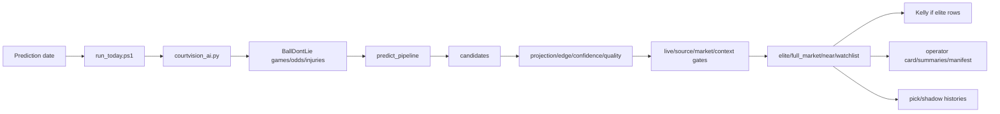

# NBA Pipeline Audit

## Current Classification

The NBA system is the canonical production-facing side of CourtVision, but "production-facing" does not mean profitable, proven, or bankroll-approved. The active runtime is `run_today.bat -> run_today.ps1 -> courtvision_ai.py`, with package modules handling prediction, scoring, and selection.

Evidence: `docs/ADR_001_CANONICAL_RUNTIME.md`, `run_today.ps1`, `courtvision_ai.py`, `courtvision/pipeline/predict_pipeline.py`.

## Providers And Configuration

| Provider/config | Current role | Evidence | Status |
| --- | --- | --- | --- |
| `BALLDONTLIE_API_KEY` | Canonical NBA provider key. | `courtvision_ai.py`, latest run log smoke check status 200. | Active |
| BallDontLie v1/v2 URLs | Games/stats/odds/injuries path. | `BALLDONTLIE_V1_BASE_URL`, `BALLDONTLIE_V2_BASE_URL`. | Active |
| `BALLDONTLIE_VENDORS` | Odds vendor filter. | `courtvision_ai.py`. | Active |
| API-NBA | Stats-only research; not live odds replacement. | `docs/api_nba_research_mode_audit.md`. | Research |
| SportsDataIO | Alternate/non-canonical provider-manager path. | `docs/ENV_CONFIG_AUDIT.md`, provider tests. | Non-canonical |
| The Odds API NBA smoke | Research/smoke tooling. | `scripts/smoke_the_odds_api_nba.py`. | Research |

## End-To-End Flow

## Candidate And Selection Logic

| Layer | Evidence | Behavior |
| --- | --- | --- |
| Candidate generation | `courtvision/pipeline/predict_pipeline.py` | Builds market candidates from games/odds/injuries/context/baselines. |
| Runtime scoring | `courtvision/runtime_scoring.py` | Applies confidence, quality, minutes, edge, and market-specific eligibility. |
| Runtime selection | `courtvision/runtime_selection.py` | Backfill thresholds, strong edge/confidence rules, player-points risk guard. |
| Operator boards | `courtvision/selection/operator_boards.py` | Live/source gates, identity quarantine, duplicate betting identity dedupe, unsupported market drops. |
| Elite market policy | `courtvision/selection/pipeline_selectors.py` | Default elite mode is `points_only`. |
| Live vs shadow | `docs/live_vs_shadow_map.md` | Elite/Kelly are live; near-elite/watchlists/shadow are not betting recommendations. |

## Elite, Near-Elite, Watchlist

| Category | Meaning | Operational implication |
| --- | --- | --- |
| Elite | Candidate passes live/source, supported market, quality/confidence, edge, context, and exposure gates. | Eligible input to Kelly if `player_points`. |
| Near-elite/review | Candidate has signal but fails one or more final gates. | Manual-review only; not a bet. |
| Watchlist/shadow/incubator | Research or caution lanes such as combo UNDER, high-caution OVER, shadow market views. | Not a betting recommendation. |

Representative thresholds found:

| Threshold | Value / behavior | Evidence |
| --- | --- | --- |
| default confidence | `0.65` | `EliteThresholds.default()` in `runtime_scoring.py` |
| quality score | `82.0` | `runtime_scoring.py` |
| player minutes | `24.0` | `runtime_scoring.py` |
| player edge | `1.5` | `runtime_scoring.py` |
| default elite market mode | points-only | `PredictionConfig.elite_market_mode` |
| runtime elite target/min backfill | 6/8 style thresholds | `runtime_selection.py` |

## Why A Run Can Produce Zero Elite Picks

A run can produce zero elite picks for several legitimate reasons:

| Cause | Evidence |
| --- | --- |
| No games or odds for selected date. | 2026-07-08 log shows games/odds/candidates zero and final `NO BET`. |
| Candidates are non-`player_points` under points-only elite policy. | `pipeline_selectors.py`, `elite_pipeline_audit_summary_2026-05-10.json`. |
| Quality/confidence/edge thresholds fail. | `runtime_scoring.py`, rejection reasons. |
| Strong OVER calibration guard blocks risky points OVERs. | `runtime_selection.py` and audit summaries. |
| Context high-caution gate blocks selections. | `docs/live_vs_shadow_map.md`, Kelly script gates. |
| Exposure caps/identity/source gates remove candidates. | `operator_boards.py`, `pipeline_selectors.py`. |

Observed example: 2026-05-28 had full-market rows and near-elite rows but elite count zero; operator card final decision was `NO BET`.

## Kelly Staking

| Item | Behavior | Evidence |
| --- | --- | --- |
| Trigger | `run_today.ps1` runs Kelly only if elite board row count is greater than zero. | `run_today.ps1` |
| Input | `outputs/runtime/operator/elite_board_DATE.csv`. | `scripts/run_kelly_stakes.py` |
| Market lock | Non-`player_points` rows skipped. | `kelly_points_only_market_lock` behavior in script |
| Sizing | Quarter-Kelly with caps and HOLD/skip states. | `courtvision/betting/kelly.py`, `scripts/run_kelly_stakes.py` |
| Daily exposure cap | Default observed 8% unless env overrides. | `COURTVISION_MAX_DAILY_EXPOSURE` handling |
| Operational evidence | `kelly_stakes_2026-05-10.csv` has 2 rows; July no-slate skipped. | runtime artifacts/logs |

Conclusion: Kelly is operational for NBA elite `player_points` rows, but bankroll deployment remains blocked by evidence and identity risks.

## Recent Operational Evidence

| Date | Evidence | Interpretation |
| --- | --- | --- |
| 2026-07-08 | `run_today_2026-07-08.log`, validation/grading logs, operator card. | Run completed safely with zero games/odds and final `NO BET`. |
| 2026-05-10 | `elite_board_2026-05-10.csv`, `kelly_stakes_2026-05-10.csv`, audit summary. | Historical elite and Kelly output path worked. |
| 2026-05-13 | elite/Kelly rows and operator card `REVIEW REQUIRED`. | Conditional recommendation path existed. |
| 2026-05-28 | full-market and near-elite rows but zero elite. | Gates can prevent bets while preserving review output. |

## Feedback Loop

| Stage | Status |
| --- | --- |
| Prediction artifact generation | Implemented |
| Official board generation | Implemented for NBA |
| Pick history tracking | Implemented but stale/sparse relative to later outputs |
| Result grading | Implemented scripts |
| Evidence ledger | Implemented but sparse |
| Model evaluation from settled picks | Partial/incomplete |

The loop exists structurally, but is not yet a robust closed feedback loop for bankroll deployment.

## Active And Inactive Branches

| Branch/path | Status |
| --- | --- |
| `run_today` canonical path | Active |
| `CourtVisionAI` package delegation | Active |
| `CourtVisionPro`/provider-manager alternate paths | Non-canonical/legacy-support |
| API-NBA path | Research-only |
| The Odds API NBA smoke | Research-only |
| Dashboard scripts | Supporting UI |
| Manual repair/backfill scripts | Supporting; use carefully |

