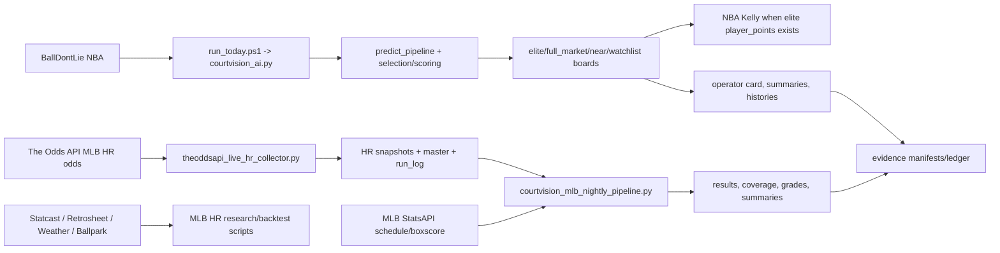

# CourtVision Full System Audit Master

Audit date: 2026-07-11  
Repository: `C:\dev\Sport_Project1`  
Audited commit: `811a07869a14bc865eec74977e6ab741ad0a0f14`  
Branch: `main`  
Scope: read-only technical audit. The only filesystem changes made were new Markdown audit files under `docs/audits/courtvision_full_system_audit/`.

## Executive Conclusion

CourtVision is a partially orchestrated sports prediction and research system. It has a canonical NBA operator workflow, an active MLB home-run market-observation collection and grading workflow, and a substantial MLB historical research/backtest layer. It also has evidence, reporting, dashboard, and cross-sport scaffolding. It is not yet a mature bankroll-ready platform because official pick identity, prospective evidence, result settlement completeness, automation observability, and deployment reproducibility remain incomplete.

Confidence: High. Evidence comes from code, docs, logs, CSV artifacts, and static script inventory.

## Current System Map

## Repository And Inventory Summary

| Item | Result |
| --- | --- |
| Current branch | `main` |
| Audited commit | `811a07869a14bc865eec74977e6ab741ad0a0f14` |
| Initial tree status | Clean before audit docs |
| Operational scripts/wrappers inventoried | 130 |
| Package modules mapped | 289 under `courtvision/` |
| Test files counted | 293 under `tests/` |
| Approximate repo files excluding common caches/envs | 12,867 |
| Approximate repo size excluding common caches/envs | 3.14 GB |
| Largest data area | `courtvision-raw/` at about 2.82 GB |

## Pipeline Inventory

| Pipeline | Trigger | Main Steps | Final Output | Automated | Operational Status |
| --- | --- | --- | --- | --- | --- |
| NBA daily operator | `run_today.bat` / `run_today.ps1` | predict -> validate -> Kelly if elite -> tracking/grading/reporting | operator artifacts/histories | Manual/schedulable | Operational with limitations |
| NBA provider/candidate/selection | inside `courtvision_ai.py` and package pipeline | BallDontLie fetch -> normalize -> score -> gates -> boards | elite/full-market/near/watchlist boards | Part of NBA run | Operational when data exists |
| NBA Kelly | `scripts/run_kelly_stakes.py` | elite board -> points-only lock -> capped quarter-Kelly | Kelly CSV | Conditional | Operational for NBA elite `player_points` |
| NBA grading/history | post-run and nightly grading scripts | record -> grade completed -> report | histories/reports | Partial | Partially operational |
| MLB HR live collection | `tools/run_live_hr_daily_auto.ps1` or collector CLI | The Odds API events/odds -> flatten HR rows -> snapshot/master/run_log | HR observation dataset | Intended daily | Verified operational as collection |
| MLB HR nightly finalization | `tools/run_courtvision_mlb_nightly_pipeline.ps1` | workbook -> StatsAPI fill -> export -> coverage -> grade/summarize | results/grades/summaries | Intended 03:30 | Verified recent operational |
| MLB HR historical research | `scripts/mlb_*` | ingest -> dataset -> readiness -> backtest/frozen predictions | research datasets/reports | Manual | Implemented research |
| Evidence workflows | `tools/run_courtvision_evidence_*.ps1` | guarded export/update | evidence manifests/ledger | Wrapper exists | Partially operational |
| Dashboard/reporting | Streamlit/dashboard scripts | read generated artifacts | local UI | Manual | Supporting |
| Alana integration | None | None | None | No | Not implemented |

## Sports And Markets

| Sport | Current implementation | Current live-pick status |
| --- | --- | --- |
| NBA | Canonical runtime, prediction, selection, Kelly, grading/reporting. | Production-facing with limitations; no guarantee of current picks or profit. |
| MLB HR | Live odds collection, result finalization, observation grading, research modelling contracts. | Research/observation workflow; no official live picks. |
| MLB general | Historical ingest/research/backtest scaffolding. | Research. |
| WNBA/NFL/NHL | Package scaffolding/plans. | Not production-facing. |

## MLB HR System, Precisely

The MLB HR collector does this:

1. Calls The Odds API MLB events endpoint.
2. Filters events with valid commence times and at least 30 minutes before start.
3. Processes up to 12 events per run.
4. Calls the event odds endpoint for `batter_home_runs_alternate`.
5. Keeps Over 0.5 player outcomes.
6. Writes a timestamped snapshot.
7. Appends and dedupes `live_hr_props_master.csv`.
8. Appends `run_log.csv` with credit usage.

It does not produce official CourtVision recommendations.

The nightly finalizer does this:

1. Selects completed dates in a lookback window.
2. Runs a preflight HR data check.
3. Regenerates/preserves the results workbook.
4. Uses MLB StatsAPI schedule and boxscore to fill final statuses and player home-run counts.
5. Exports strict results.
6. Runs coverage.
7. Grades only dates that are ready.
8. Summarizes grades.

It does not collect new odds.

## NBA System, Precisely

The NBA path is:

`run_today.bat -> run_today.ps1 -> courtvision_ai.py --prediction-date DATE --predict-only --verbose-outputs -> package prediction pipeline -> validation/audits -> Kelly if elite rows -> tracking/grading/shadow/reporting`

Key rules:

| Rule | Evidence |
| --- | --- |
| Canonical provider path is BallDontLie. | `courtvision_ai.py`, ADR, latest logs |
| Elite defaults are strict quality/confidence/edge gates. | `runtime_scoring.py`, `runtime_selection.py` |
| Elite market mode defaults to points-only. | `predict_pipeline.py`, selectors |
| Near-elite/watchlists are review or research only. | `docs/live_vs_shadow_map.md` |
| Kelly runs only on non-empty elite board and locks to NBA `player_points`. | `run_today.ps1`, `run_kelly_stakes.py` |

Recent evidence:

| Date | Evidence | Meaning |
| --- | --- | --- |
| 2026-07-08 | no games/odds; final `NO BET`; artifact manifest completed without fatal missing files | No-slate run can complete safely. |
| 2026-05-10 | elite and Kelly rows exist | Historical pick/stake path worked. |
| 2026-05-28 | full market and near-elite existed, elite zero | Empty elite can be an expected gate result. |

## External Dependency Table

| Provider | Purpose | Used By | Credentials | Quota/Cost Risk | Current Status |
| --- | --- | --- | --- | --- | --- |
| BallDontLie | NBA games/stats/odds/injuries | `courtvision_ai.py` | `BALLDONTLIE_API_KEY` | Subscription/key limits | Canonical NBA |
| The Odds API | MLB HR odds observations; NBA smoke/research | HR collector, smoke scripts | `THE_ODDS_API_KEY` | Paid credits | Active HR collection |
| MLB StatsAPI | MLB final schedule/boxscore/player HR results | HR filler | None observed | Availability/rate | Active finalization |
| API-NBA | NBA stats research | smoke/research scripts | `API_NBA_KEY`/`API_SPORTS_KEY` | Subscription | Research-only |
| SportsDataIO | Alternate NBA provider path | provider manager/tests | `SPORTSDATAIO_API_KEY` | Subscription | Non-canonical |
| Statcast/Retrosheet/Chadwick/weather | MLB historical data | MLB research scripts | files/downloads | Data availability | Research |
| Telegram | Optional alert delivery | `courtvision_ai.py` | `TELEGRAM_BOT_TOKEN`, `TELEGRAM_CHAT_ID` | Delivery risk | Optional |
| Alana | Not present | None | None | N/A | Not implemented |

## Findings Summary

| Severity | Count | IDs |
| --- | ---: | --- |
| Critical | 3 | F-001 to F-003 |
| High | 7 | F-004 to F-010 |
| Medium | 10 | F-011 to F-020 |
| Low | 4 | F-021 to F-024 |
| Informational | 6 | F-025 to F-030 |

Top critical findings:

| ID | Finding | Impact |
| --- | --- | --- |
| F-001 | No universal immutable official pick ID. | Grading/settlement/performance ambiguity. |
| F-002 | MLB HR observations can be mistaken for official picks. | Misleading ROI and bankroll risk. |
| F-003 | Prospective evidence is incomplete. | Trustworthy live-pick claims are not established. |

## Direct Answers To The 40 Special Questions

| # | Question | Answer | Confidence |
| ---: | --- | --- | --- |
| 1 | What is CourtVision today? | A local, artifact-heavy sports prediction/research system with a canonical NBA operator pipeline and separate MLB HR observation/result/grading workflows. | Confirmed |
| 2 | Is CourtVision one application or multiple loosely connected pipelines? | Multiple loosely connected pipelines with partial orchestration. NBA has the strongest canonical runner; MLB HR and evidence flows are separate. | Confirmed |
| 3 | Which sports are actually implemented? | NBA is production-facing with limitations; MLB HR collection/grading and MLB research are implemented. | Confirmed |
| 4 | Which sports are merely planned? | WNBA, NFL, NHL, and broader production MLB markets are planned/research/scaffolded, not production-facing. | High confidence |
| 5 | Which pipelines currently run successfully? | Recent evidence supports MLB HR daily collection and nightly finalization; NBA no-slate daily run completed on 2026-07-08; historical NBA elite/Kelly outputs exist. | Confirmed |
| 6 | Which pipelines are automated? | MLB HR daily collection and 03:30 finalization have wrappers/docs/logs; NBA nightly grader has installer; evidence wrappers exist. Actual scheduler installation was not queried. | High confidence |
| 7 | What exactly happens during the daily automated run? | The MLB daily wrapper pulls main, checks duplicate same-day collection, runs the HR collector if needed, then runs offline HR daily check. | Confirmed |
| 8 | What exactly happens during the 3:30 a.m. job? | Consolidated MLB finalizer selects completed dates, checks data, builds/preserves workbook, fills StatsAPI results, exports strict results, runs coverage, grades ready dates, writes summaries. | Confirmed |
| 9 | Does the 3:30 a.m. job collect new home-run odds? | No. The consolidated pipeline does not call the HR odds collector. | Confirmed |
| 10 | How does the system check final game scores? | MLB HR uses MLB StatsAPI schedule final status; NBA grading uses its result/history grading scripts and provider/result data. | Confirmed for MLB, medium for full NBA internals |
| 11 | How does the system determine which players hit home runs? | MLB HR extracts batting `homeRuns` from MLB StatsAPI boxscore and matches normalized player names. | Confirmed |
| 12 | Is that process automatic, manual, or hybrid? | Hybrid: automatic StatsAPI fill where possible, manual/workbook review for unresolved/void-candidate cases. | Confirmed |
| 13 | Does the MLB home-run pipeline currently make predictions? | The live collector/finalizer do not. Research scorers/backtest contracts exist separately. | Confirmed |
| 14 | Does it currently produce official picks? | No repository evidence that MLB HR currently produces official CourtVision picks. | High confidence |
| 15 | Is it currently only collecting a research dataset? | For live HR odds, yes: it collects and grades market observations for research/evaluation. | High confidence |
| 16 | What is the difference between a collected prop row and a CourtVision pick? | A prop row is a bookmaker quote; a pick is a selected recommendation with model context, official identity, timestamp, and settlement lifecycle. | Confirmed conceptually |
| 17 | Can the system currently grade every collected home-run prop? | No. Rows must have complete/valid result fields and final/resolved statuses. | Confirmed |
| 18 | What prevents rows from being ready to grade? | Missing event/player/actual/status fields, invalid statuses, unmatched games/players, blank workbook rows, void candidates, manual review. | Confirmed |
| 19 | Can repeated odds snapshots accidentally be counted as multiple bets? | Yes, if observations are interpreted as bets. Master dedupe reduces duplicates, but snapshots and repeated observations remain; no official pick ID prevents clean separation. | High confidence |
| 20 | What uniquely identifies an official pick? | No universal official pick ID exists. NBA uses composite fields; MLB results use `(event_id, player)` and odds observation fields. | Confirmed |
| 21 | Is there a closed feedback loop from prediction to result to model evaluation? | Partial only. Outputs, histories, grading, and evidence artifacts exist, but not complete/proven enough for bankroll claims. | High confidence |
| 22 | Does the NBA pipeline currently work end to end? | It can complete end-to-end operationally, including no-bet and historical pick runs. Current live provider status was not rechecked on 2026-07-11. | High confidence |
| 23 | Which NBA features are operational? | BallDontLie fetch path, odds normalization, candidate scoring/selection, elite/full-market/near outputs, Kelly for elite points, validation, reports, histories/grading scripts. | Confirmed |
| 24 | How are elite, near-elite, and watchlist picks determined? | By live/source/market gates, thresholds for confidence/quality/edge/minutes, context guards, points-only elite policy, rejection reasons, and reporting lanes. | Confirmed |
| 25 | Why can a run produce zero elite picks? | No games/odds, all candidates filtered by market policy, quality/confidence/edge, context/OVER guard, exposure caps, identity/source gates, or no supported markets. | Confirmed |
| 26 | Is Kelly staking operational? | Yes for NBA elite `player_points` rows, conditional on non-empty elite board; not proven for bankroll deployment and not active for MLB HR. | Confirmed |
| 27 | Which APIs or subscriptions are required? | BallDontLie, The Odds API, optional/noncanonical SportsDataIO/API-NBA, MLB StatsAPI public, historical Statcast/Retrosheet/Chadwick/weather sources. | Confirmed |
| 28 | Which former APIs are no longer available? | The repo does not prove a former API is currently unavailable. It does show noncanonical/legacy/alternate provider paths and API-NBA research-only status. | Unknown/medium |
| 29 | What happens when API credits run out? | The Odds API collector records request usage/remaining and failures in run log; failed API calls stop/mark the run. NBA provider failures degrade to diagnostics/empty outputs depending path. | High confidence |
| 30 | Which scripts are safe to run repeatedly? | Offline readers/checkers are safest; collectors, exporters, graders, backfills, installers, and live smoke scripts should not be rerun casually. | High confidence |
| 31 | Which scripts overwrite or append data? | Collector appends snapshots/master/run log; workbook/export/grade/report scripts write/overwrite outputs; histories append/update; backfills/repairs mutate histories. | Confirmed |
| 32 | Which scripts require manual spreadsheet work? | The MLB HR results workbook workflow can require manual review/edits for unresolved statuses. | Confirmed |
| 33 | Which files are source-of-truth datasets? | NBA elite board/history/evidence for official candidates; HR snapshots/master for observations; HR workbook/results for settlement; raw MLB manifests for research provenance. | High confidence |
| 34 | Which outputs are temporary or generated? | `outputs/runtime/*`, HR grade summaries/logs, automation logs, many `data/history` outputs, caches/test artifacts. | Confirmed |
| 35 | Which scripts are disconnected or orphaned? | Legacy finalizer, alternate provider paths, ODDSPAPI/probe-style scripts, some dashboards/research reports, and cross-sport scaffolding are not active canonical paths. | Medium/high |
| 36 | Which documentation is outdated? | Older audits/plans and some phase docs may be stale; `.env.example` is incomplete/confusing per `ENV_CONFIG_AUDIT`; doc status needs owner confirmation. | High confidence |
| 37 | What are the top five blockers to trustworthy live picks? | Prospective evidence, official pick IDs, observation-vs-pick separation, complete result settlement, reproducible monitored automation. | High confidence |
| 38 | What are the top five blockers to full automation? | Manual/unresolved results, no central locks/alerts, API quota/failure monitoring, mutable git/local interpreter assumptions, incomplete run-status/evidence coverage. | High confidence |
| 39 | What should be built next? | Official pick schema, observation/pick separation, settlement queue, forward paper trial, automation health dashboard, config cleanup. | Recommendation |
| 40 | What is the recommended long-term target architecture? | Typed provider adapters -> immutable raw store -> normalized facts -> feature/model registry -> official picks table -> settlement/evaluation ledger -> gated risk engine -> read-only API/UI/Alana surface. | Recommendation |

## Current Maturity Table

| Capability | Score 0-5 | Evidence | Next Requirement |
| --- | ---: | --- | --- |
| Repository organization | 3 | Structured but script-heavy repo. | Entrypoint registry and deprecations. |
| Data ingestion | 4 | Active NBA and MLB HR provider code/logs. | Monitoring/fallbacks. |
| Prediction capability | 3 | NBA active, MLB research. | Prospective validation. |
| Pick generation | 3 | NBA elite board. | Official pick IDs and forward evidence. |
| MLB HR official picks | 1 | No active official selector. | Build model-to-pick layer. |
| Result collection | 3 | StatsAPI filler and grading scripts. | Complete reconciliation. |
| Grading | 3 | NBA and MLB graders. | Separate pick vs observation performance. |
| Automation | 3 | Wrappers/logs. | Locks, alerts, pinned manifests. |
| Monitoring | 2 | Logs/cards only. | Run dashboard/status. |
| Testing | 3 | 293 tests. | Current controlled test run. |
| Deployment readiness | 2 | Local Windows scripts. | Portable deployment runbook. |
| Multi-sport readiness | 2 | Scaffolding. | Sport promotion gates. |

## Roadmap Summary

| Phase | Objective | Exit criteria |
| --- | --- | --- |
| A | Stabilize current pipelines | One current entrypoint per workflow, pinned manifests, locks. |
| B | Complete results/grading loop | No blank completed rows; manual review queue explicit. |
| C | Establish predictive validity | Frozen forward trials with predeclared metrics. |
| D | Generate controlled paper picks | Immutable official pick table and paper-only reports. |
| E | Automate monitoring/reporting | Run health, quota, unresolved rows, missed jobs visible. |
| F | Introduce bankroll logic | Evidence gates met; kill switch and risk controls. |
| G | Expand sports/markets | Each sport passes provider/result/model/evidence gates. |
| H | Integrate Alana/UI | Stable read-only API/JSON surface for official outputs. |

## Areas Not Conclusively Audited

| Area | Reason |
| --- | --- |
| Current live API health on 2026-07-11 | No live API calls were allowed. |
| Current Windows Scheduled Task installation | Scheduler state was not queried or modified. |
| Current full test-suite health | Tests were not run. |
| Dashboard visual correctness | Dashboards were not launched. |
| External Alana repositories/services | Only this repo was audited. |
| Secret values | `.env` values were not exposed or copied. |

## Audit Deliverables

| File | Purpose |
| --- | --- |
| `00_executive_summary.md` | Plain-language summary and immediate risks. |
| `01_repository_inventory.md` | Repo, script, dependency, data inventory. |
| `02_system_architecture.md` | Architecture layers and Mermaid diagrams. |
| `03_pipeline_catalog.md` | Pipeline-by-pipeline catalog. |
| `04_script_reference.md` | Script reference and full operational appendix. |
| `05_data_lineage.md` | Dataset inventory and producer-consumer maps. |
| `06_mlb_hr_pipeline_audit.md` | Detailed MLB HR audit. |
| `07_nba_pipeline_audit.md` | Detailed NBA audit. |
| `08_automation_operations.md` | Automation and scheduled-operation analysis. |
| `09_models_and_decision_logic.md` | Models, gates, thresholds, Kelly. |
| `10_testing_and_validation.md` | Tests and validators. |
| `11_risks_gaps_and_technical_debt.md` | Findings register. |
| `12_current_state_and_roadmap.md` | Maturity scoring and roadmap. |
| `13_evidence_index.md` | Traceability index. |
| `14_open_questions.md` | Unknowns and verification paths. |

